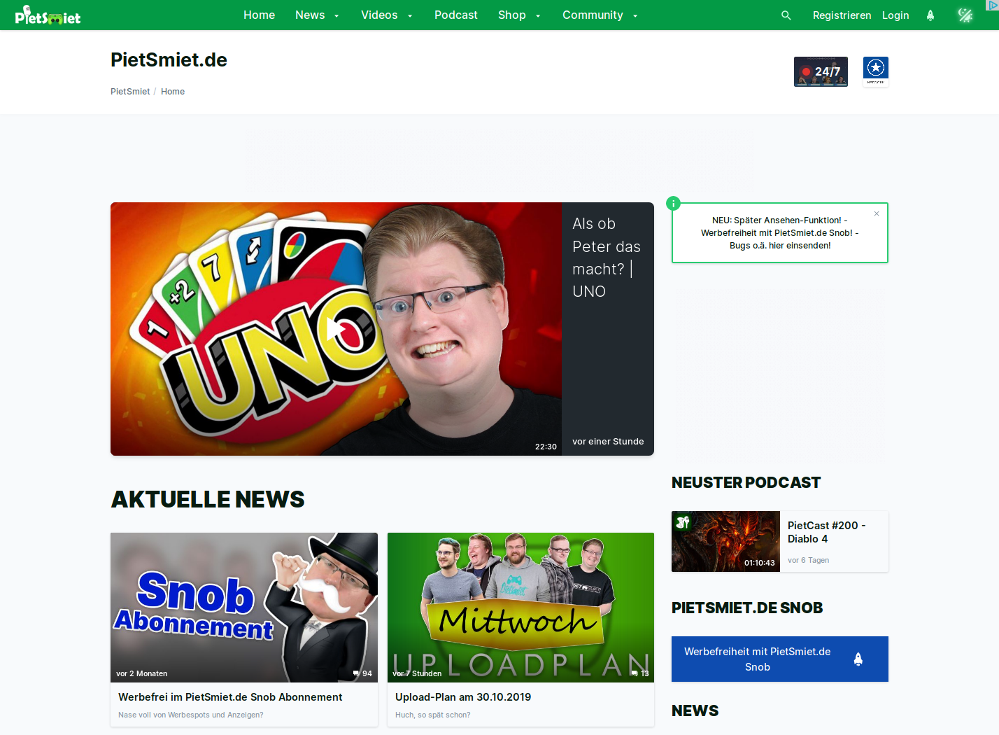
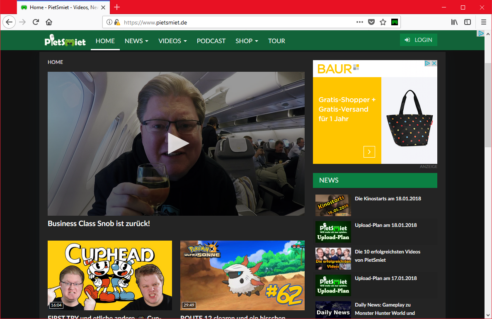
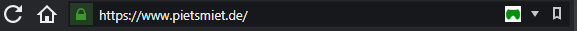
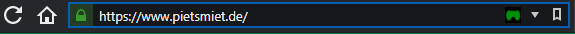
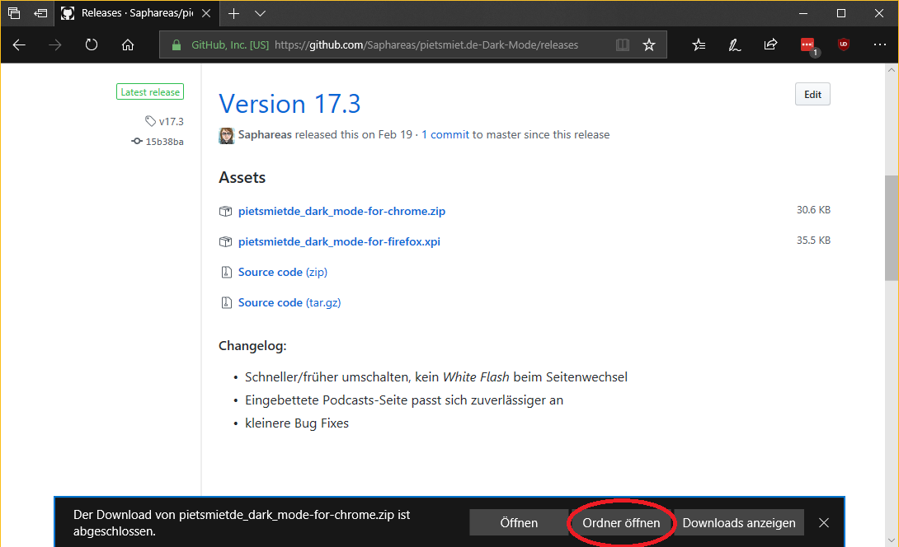
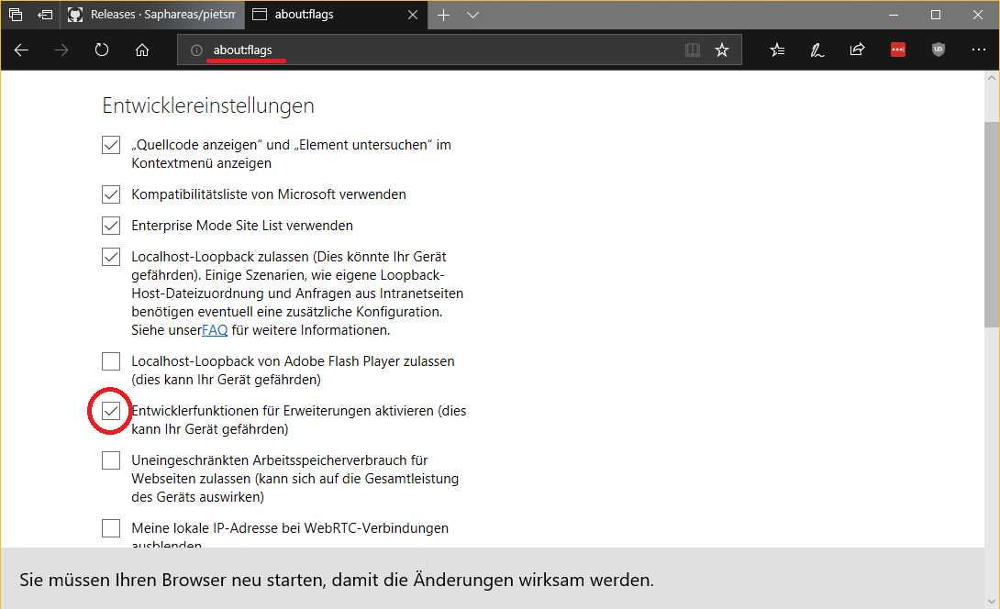
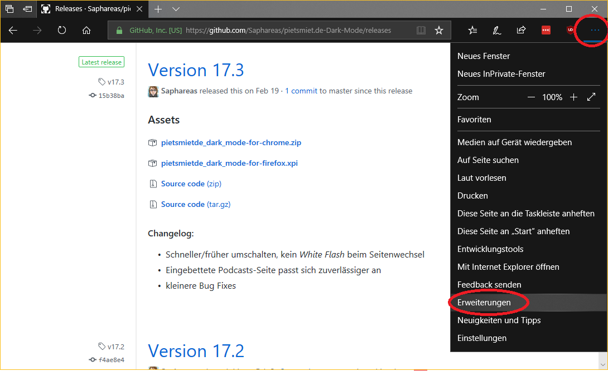
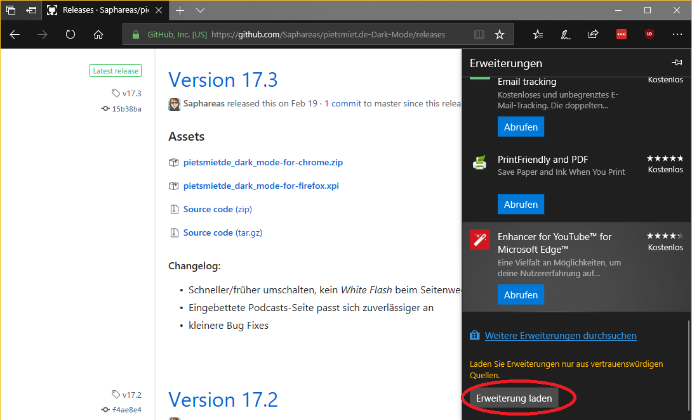

# Pietsmiet Dark Mode

<!-- TOC -->

- [Pietsmiet Dark Mode](#pietsmiet-dark-mode)
  - [Motivation](#motivation)
  - [Vorschau](#vorschau)
  - [Wie funktioniert's?](#wie-funktionierts)
  - [Installation](#installation)
    - [Manuell](#manuell)
      - [Chrome ](#chrome-chromegithubchrome-logo-smallpng)
      - [Edge ](#edge-edgegithubedge-logo-smallpng)
  - [Bei Problemen/Vorschlägen](#bei-problemenvorschlägen)

<!-- /TOC -->

## Motivation

Ich bin jemand, der gerne Abends im Bett und vor dem Schlafen Pietsmiet-Videos schaut. Dabei wurden mir von hellen Website-Gestaltung regelmäßig die Augen ausgebrannt. **Deshalb** habe ich dieses Projekt gestartet, das der pietsmiet.de-Seite einen augenschonenden, dunklen Anstrich verpasst.

## Vorschau

## Wie funktioniert's?

Wenn ihr die Erweiterung für euren Browser installiert habt, erscheint in der Adressleiste ein Pietsmiet-Icon, sobald ihr pietsmiet.de aufruft.

Sobald ihr auf dieses Icon klickt, wird die Seite abgedunkelt und das Icon wechselt zu schwarz.

Ein weiterer klick macht dies rückgängig.
Das dunkle Theme bleibt auch aktiv, wenn ihr euren Browser neustartet.

## Installation

**INFO:**
Die Erweiterung wird vorerst NICHT im Addon-Store von Chrome erscheinen, da ich dafür eine Kreditkarte bräuchte.
Für die Veröffentlichung der Edge-Version im Microsoft Store habe ich mich schon beworben. Es ist nur noch eine Frage der Zeit.

### Manuell

#### Chrome 
(und Chromium-basierte, wie Opera oder Vivaldi)

1. Erweiterung (.crx-Datei) [hier herunterladen](https://github.com/Saphareas/pietsmiet.de-Dark-Mode/releases/latest)
2. In Chrome die _Erweiterungen_-Seite aufrufen
3. Entwicklermodus anschalten, dann die Seite neu laden und die runtergeladene Datei aus deinem Downloads-Ordner in den Browser ziehen.

#### Edge 

3. Runtergeladene Zip-Datei in Ordner entpacken

4. In Edge die _Flags_-Seite aufrufen und den Entwicklermodus anschalten

5. Erweiterungsmenü öffnen...

...und die Erweiterung laden (den Ordner, in den ihr die Zip entpackt habt)

## Bei Problemen/Vorschlägen

Einfach [hier auf Github](https://github.com/Saphareas/pietsmiet.de-Dark-Mode/issues) (im Reiter _Issues_) einen entsprechenden Thread öffnen. Wer die Skills hat, kann natürlich auch dieses Repository forken und eine Pull-Request senden.

## Lizenz

Sämtlicher Code in diesem Repository unterliegt der beiliegenden [MIT-Lizenz](LICENSE). Für eine Zusammenfassung der Lizenz siehe https://www.tldrlegal.com/l/mit.

_Die Rechte in den Bildern liegen bei Pietsmiet._
_The copyrights for the images are owned by Pietsmiet._
