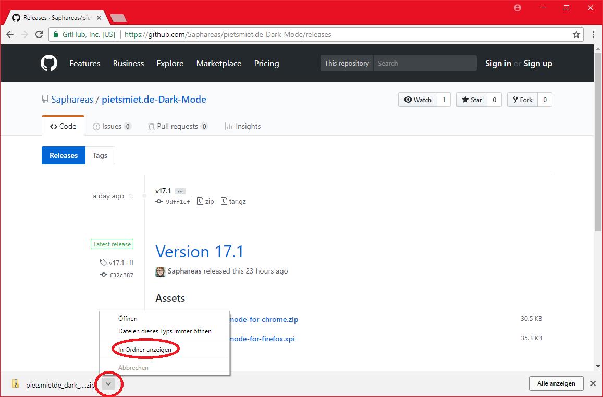

# Pietsmiet Dark Mode

<!-- TOC -->

- [Motivation](#motivation)
- [Vorschau](#vorschau)
- [Wie funktioniert's?](#wie-funktionierts)
- [Installation](#installation)
    - [Aus den Web Stores](#aus-den-web-stores)
    - [Manuell](#manuell)
        - [Chrome](#chrome)
        - [Firefox](#firefox)
- [Bei Problemen/Vorschlägen](#bei-problemenvorschlägen)

<!-- /TOC -->

## Motivation
Ich bin jemand, der gerne Abends im Bett und vor dem Schlafen Pietsmiet-Videos schaut. Dabei wurden mir von hellen Website-Gestaltung regelmäßig die Augen ausgebrannt. **Deshalb** habe ich dieses Projekt gestartet, das der pietsmiet.de-Seite einen augenschonenden, dunklen Anstrich verpasst.

## Vorschau

## Wie funktioniert's?
Wenn ihr die Erweiterung für euren Browser installiert habt, erscheint in der Adressleiste ein Pietsmiet-Icon, sobald ihr pietsmiet.de aufruft.

Sobald ihr auf dieses Icon klickt, wird die Seite abgedunkelt und das Icon wechselt zu schwarz.

Ein weiterer klick macht dies rückgängig.
Das dunkle Theme bleibt auch aktiv, wenn ihr euren Browser neustartet.

## Installation
### Aus den Web Stores
**INFO:** Die Erweiterung wird NICHT im Addon-Store von Chrome erscheinen, da ich dafür eine Kreditkarte bräuchte.

### Manuell
#### Chrome 
(und Chromium-basierte, wie Opera oder Vivaldi)
1. Erweiterung [hier herunterladen](https://github.com/Saphareas/pietsmiet.de-Dark-Mode/releases)
2. Runtergeladene Zip-Datei in Ordner entpacken

3. In Chrome die _Erweiterungen_-Seite aufrufen

4. Entwicklermodus anschalten und die Erweiterung laden (den Ordner, in den ihr die Zip entpackt habt)

#### Firefox 
1. Erweiterung [hier herunterladen](https://github.com/Saphareas/pietsmiet.de-Dark-Mode/releases)
2. Die Erweiterungs-Datei sollte automatisch vom Firefox geöffnet werden. Einfach den Anweisungen folgen.

## Bei Problemen/Vorschlägen
Einfach [hier auf Github](https://github.com/Saphareas/pietsmiet.de-Dark-Mode/issues) (im Reiter _Issues_) einen entsprechenden Thread öffnen. Wer weiß, was er/sie macht, kann natürlich auch dieses Ropository forken und eine Pull-Request senden.

_Einige Dateien in diesem Repository stehen unter einer angepassten **Beer-ware** Lizenz. (siehe Header in entsprechenden Dateien)
Die Rechte in den Bildern liegen bei Pietsmiet._

_Some files in this repository are licensed under a customized version of the **Beer-ware** License. (see Header of the affected files)
The copyrights for the images are  owned by Pietsmiet._
